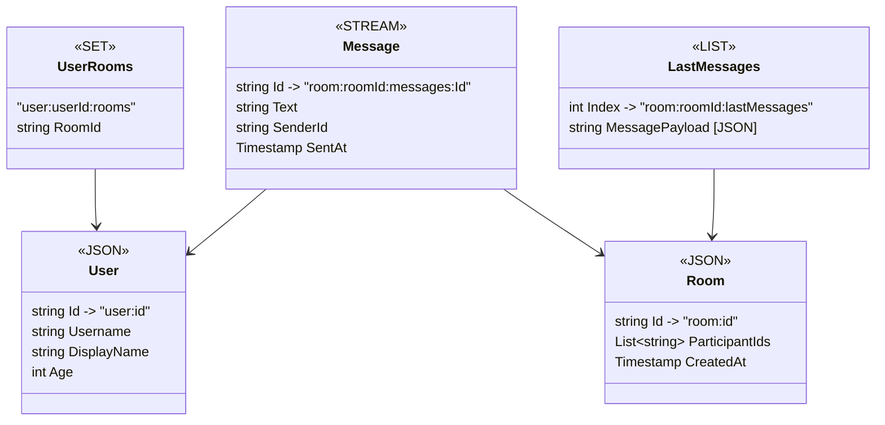

# Chat Application
Chat Application Built for Advanced Database Systems subject

# Database Diagram

> [!NOTE]
> It's hard to visualize the Redis data structures becuase Redis is not a typical collection based NoSQL database.
