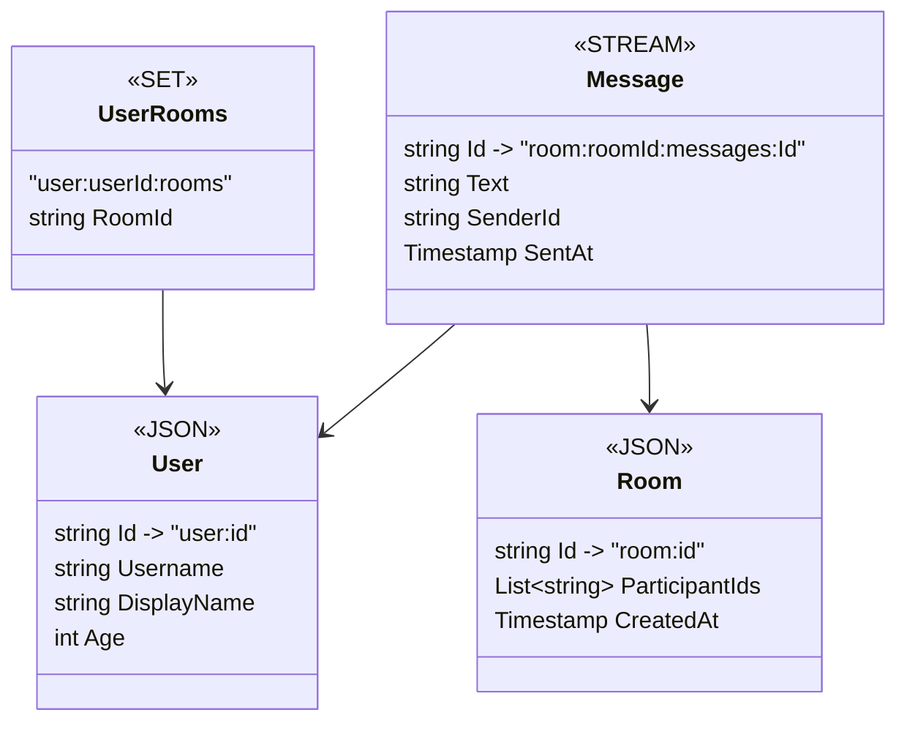

# Chat Application
Chat Application Built for Advanced Database Systems subject

# Table of Contents
- [Chat Application](#chat-application)
- [Table of Contents](#table-of-contents)
- [Database Diagram](#database-diagram)
- [How to Run](#how-to-run)
  - [Prerequisites](#prerequisites)
  - [Quick Start command](#quick-start-command)
  - [Detailed guide to running the project](#detailed-guide-to-running-the-project)
    - [Step 1. Clone the project](#step-1-clone-the-project)
    - [Step 2. Navigate to Docker configuration folder](#step-2-navigate-to-docker-configuration-folder)
    - [Step 3. Create a copy of the example environment file](#step-3-create-a-copy-of-the-example-environment-file)
    - [Step 4. Run the server](#step-4-run-the-server)
    - [5. Running the client UI](#5-running-the-client-ui)
    - [6. Docker cleanup](#6-docker-cleanup)
  - [Runing the server without Docker](#runing-the-server-without-docker)
    - [Create `.env` from `.env.example`](#create-env-from-envexample)


# Database Diagram


```mermaid
classDiagram
    class User {
        <<JSON>>
        string Id -> "user:id"
        string Username
        string DisplayName
        int Age
    }

    class UserRooms {
        <<SET>>
        "user:userId:rooms"
        string RoomId
    }

    class Room {
        <<JSON>>
        string Id -> "room:id"
        List~string~ ParticipantIds
        Timestamp CreatedAt
    }

    class Message {
        <<STREAM>>
        string Id -> "room:roomId:messages:Id"
        string Text
        string SenderId
        Timestamp SentAt
    }

    UserRooms --> User
    Message --> User
    Message --> Room
```

> [!NOTE]
> It's hard to visualize the Redis data structures becuase Redis is not a typical collection based NoSQL database.

---

# How to Run
You need to have ```docker``` and ```docker compose``` in order to run the server.
For the client UI you will need to configure `node`;

---

## Prerequisites
- Docker – [Install guide](https://docs.docker.com/engine/install)
- Docker Compose – [Install guide](https://docs.docker.com/compose/install)
- Node.js - [Install guide](https://nodejs.org/en/download)

Make sure `Docker` and `node` are running before proceeding.

> [!IMPORTANT]
> On linux system you might need to run all docker commands with `sudo`.

---

## Quick Start command
```bash
git clone https://github.com/cjovan02/chat-app.git
cd chat-app/docker
cp .env.example .env
docker compose up --build
```

> [!NOTE]
This will run the server. To run client app, see section [Running the client UI](#5-running-the-client-ui)

---

## Detailed guide to running the project

### Step 1. Clone the project 
```bash
git clone https://github.com/cjovan02/chat-app.git
cd chat-app
```

### Step 2. Navigate to Docker configuration folder
```bash
cd ./docker
```

This folder contains **docker configuration** to run the services.

### Step 3. Create a copy of the example environment file
```bash
cp .env.example .env
```
> [!TIP]
> It's recommended to change ```REDIS_PASSWORD``` for security,
> but for testing purposes, the defaults will work.
> You can also tweak other environment variables if needed.

### Step 4. Run the server
```bash
docker compose up --build
```

This will start Redis database and the server.

These are the exposed ports from the server:
|    Service    |               URL             |    Port   |    Description            |
| ------------- | ------------------------------| --------- | ------------------------- |
| Swagger UI    | http://localhost:7002/swagger |   7000    | REST API Documentation    |


This means you can visit ```http://localhost:7000/swagger``` to explore the API.

### 5. Running the client UI
The project includes UI interface for testing. Clent is not run with docker compose, that's why you need to instal `node`.

To run the client make sure you are in the **frontend** folder and then run
```bash
npm install
npm run start
```

Window with the UI client will open up. 

> [!TIP]
> You can also visit `http:localhost:5173` (or the port you provided in the .env.example) to open another instance of the client application

### 6. Docker cleanup
```bash
docker compose down -v
```
This will delete all containers created previously.

## Runing the server without Docker

You can also run the server locally by just copying the the `.env.example` in the server root folder and running it with your favorite IDE.

### Create `.env` from `.env.example`
```bash
cd chat-app/backend/Api
cp .env.example .env
```


